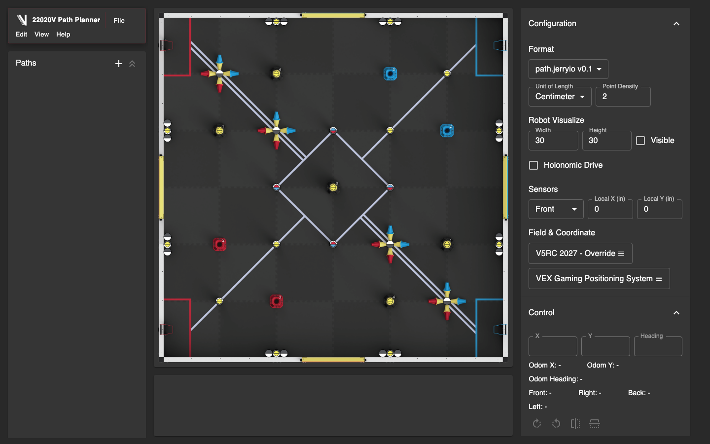
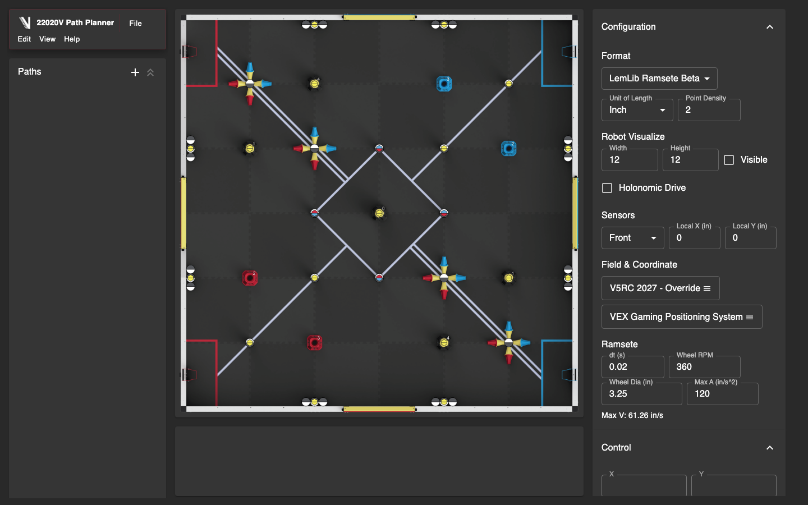

<p align="center">
  <a href="https://22020-v-override-custom-path-planne.vercel.app/">
    
  </a>
</p>

<h1 align="center">22020V Path Planner</h1>

<p align="center">
  A VEX autonomous path planner for designing routes, visualizing DSR sensors, simulating chained paths, and exporting LemLib-compatible Pure Pursuit or Ramsete trajectories.
</p>

<p align="center">
  <a href="https://22020-v-override-custom-path-planne.vercel.app/">Open the live planner</a>
  |
  <a href="#quick-start">Quick start</a>
  |
  <a href="#attribution">Attribution</a>
</p>

---

## About

22020V Path Planner is a modified GPL-3.0 fork of [PATH.JERRYIO](https://github.com/Jerrylum/path.jerryio) by Jerry Lum. The core canvas editor, path editing model, field interaction system, and original planner foundation come from Jerry's PATH.JERRYIO work.

This fork keeps the original editor workflow while adding 22020V branding and team-specific autonomous planning tools for PROS/LemLib projects.



## What This Fork Adds

- Dark red 22020V visual theme and team logo branding.
- V5RC 2027 Override field assets and 72 in by 72 in field sizing.
- DSR-style sensor rays from the simulated robot with live front, right, back, and left distance readouts.
- Sensor offset configuration in local robot coordinates.
- `LemLib Ramsete Beta` custom export format.
- Ramsete trajectory export rows:

```txt
time_s, x_in, y_in, theta_rad, v_ips, omega_radps
```

- Wheel RPM and wheel diameter inputs that compute Ramsete max velocity.
- Whole-path reverse support using negative `v_ips` for reversed Ramsete paths.
- Path playback simulation for the selected path or the full visible route.
- Motion-chain endpoint snapping with gold connected-point indicators.
- DSR preview controls for chained points.



## Quick Start

1. Open the hosted app:
   [https://22020-v-override-custom-path-planne.vercel.app/](https://22020-v-override-custom-path-planne.vercel.app/)
2. Pick a format in `Configuration`.
   - Use `LemLib v0.5` for the original Pure Pursuit style export.
   - Use `LemLib Ramsete Beta` for time-based Ramsete trajectories.
3. Draw or edit paths on the field.
4. For Ramsete, set wheel RPM, wheel diameter, timestep, and acceleration.
5. Use `Simulate` to run the selected path or the full route.
6. Export the path file and load it in your robot project.

## Ramsete Export

`LemLib Ramsete Beta` exports one selected path as a time-based trajectory. The file rows are intended for a robot-side Ramsete controller:

```txt
# RAMSETE v1
# time_s, x_in, y_in, theta_rad, v_ips, omega_radps
0.000, 0.000, 0.000, 0.000, 0.000, 0.000
0.020, 0.250, 0.000, 0.000, 12.500, 0.000
endData
#PATH.JERRYIO-DATA ...
```

Notes:

- `x_in` and `y_in` are LemLib-style odom inches.
- `theta_rad` follows the path tangent for forward paths.
- Reversed paths use `theta_rad = tangent + pi` and negative `v_ips`.
- Robot-side constants such as `b`, `zeta`, and drivetrain track width stay in robot code.
- `#PATH.JERRYIO-DATA` is kept after `endData` so the planner can reopen exported files.

## DSR And Sensors

The robot preview can show four red sensor rays. Each sensor has a local robot offset:

- `x` is side-to-side relative to robot center.
- `y` is front/back relative to robot center.
- Ray lengths stop at field walls.
- Live readings appear in the Control panel.

For chained gold points, DSR preview can be enabled separately. The DSR heading can either follow the next path's start heading or be manually overridden.

## Motion Chaining

When the end of one path is dragged close to the start of another path, the helper can snap the two endpoints together. They stay as separate endpoints, so each path can keep its own settings.

Use this for autonomous routines where each movement is a separate Ramsete file or action:

- Split when you need a stop, turn, intake action, clamp action, or DSR reset.
- Use `Reverse path` when the robot should traverse the whole path backwards.
- Use `Run Entire Route` to visually check the chain order.

## Local Development

```bash
npm install
npm start
```

Build a production copy:

```bash
npm run build
```

Run the checks used during development:

```bash
npm run check-format
npm test -- --watchAll=false
```

## Deploying

This project deploys cleanly as a static React app.

Recommended Vercel settings:

- Framework preset: `Create React App`
- Build command: `npm run build`
- Output directory: `build`

Any push to the connected GitHub repository can automatically redeploy the public site.

## Attribution

This project is a fork of [PATH.JERRYIO](https://github.com/Jerrylum/path.jerryio), originally created by [Jerry Lum](https://github.com/Jerrylum).

Important credit:

- Jerry Lum created the original PATH.JERRYIO canvas editor and planner foundation.
- The core path editing interactions, canvas architecture, import/export foundation, and much of the app structure are inherited from PATH.JERRYIO.
- 22020V Path Planner modifies that GPL-3.0 project with team branding, DSR visualization, Ramsete export/simulation work, and motion-chaining helpers.

The project remains licensed under GPL-3.0. See [LICENSE](./LICENSE).
